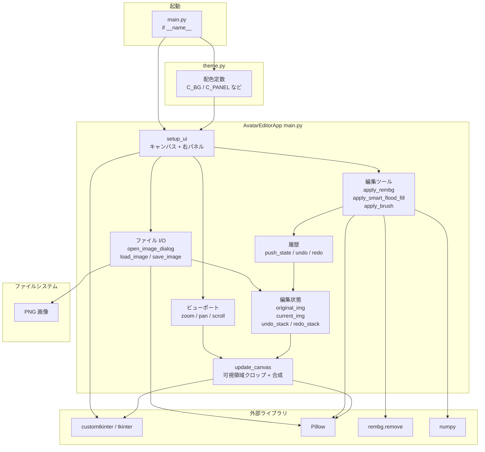
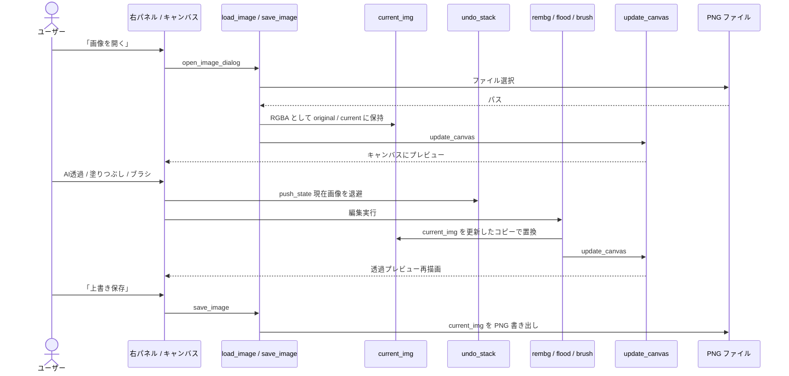
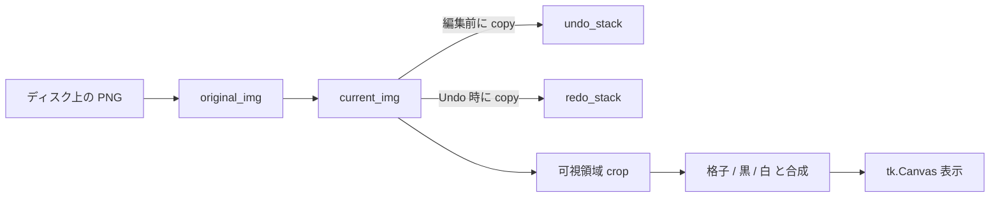

# Artemis Background Remover — アーキテクチャ

スタンドアロン GUI（Python / CustomTkinter）です。画面・編集・描画はほぼすべて `main.py` の `AvatarEditorApp` にあり、配色は `theme.py` から取り込みます。

## ソース構成

| パス | 役割 |
|------|------|
| `main.py` | エントリポイント。ウィンドウ、I/O、編集、ビューポート描画 |
| `theme.py` | ダークモードとカラー定数 |
| `requirements.txt` | `customtkinter`, `Pillow`, `rembg`, `numpy` |
| `assets/avatars/` | 起動時フォールバック用 preset（あれば） |

## コンポーネントと依存関係

## データの流れ（画像を開く → 編集 → 保存）

## 状態モデル

- 編集は `current_img` を直接破壊せず、コピーしたうえで差し替えます（`push_state` でスナップショット）。
- プレビュー背景（`preview_bg_mode`）は表示専用で、保存されるアルファには混ぜません。
- `apply_rembg` は実行時に `from rembg import remove` します。
